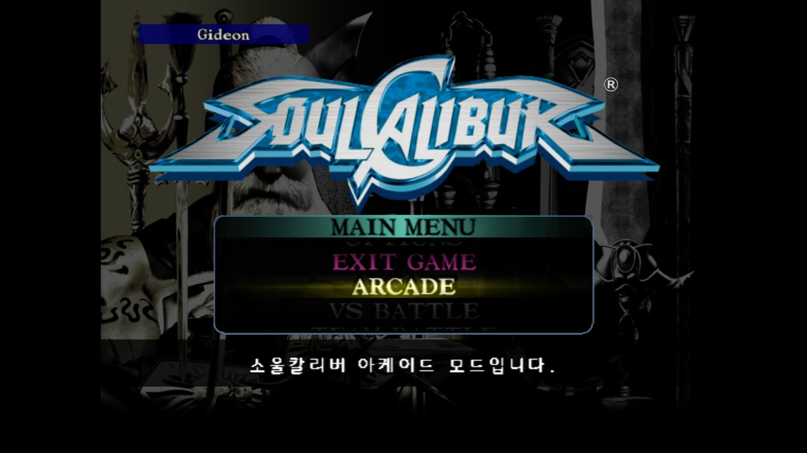
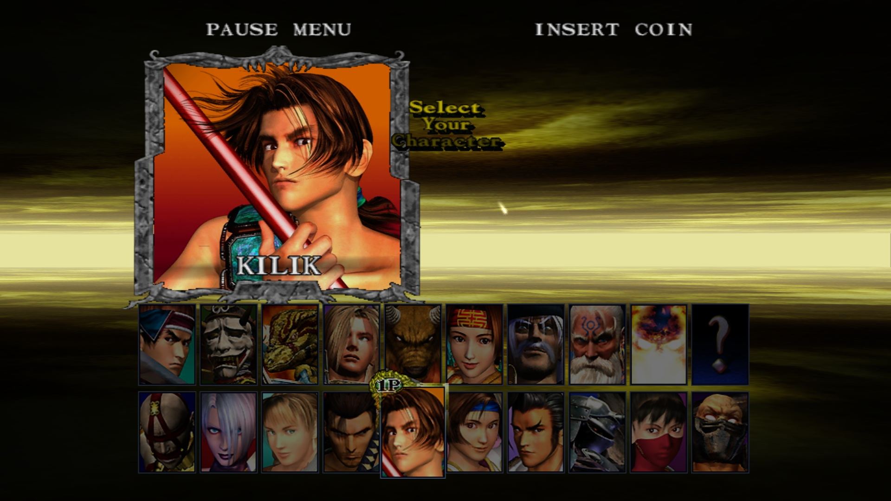
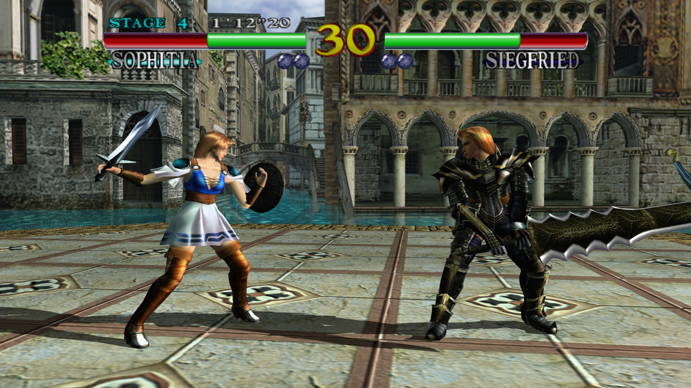
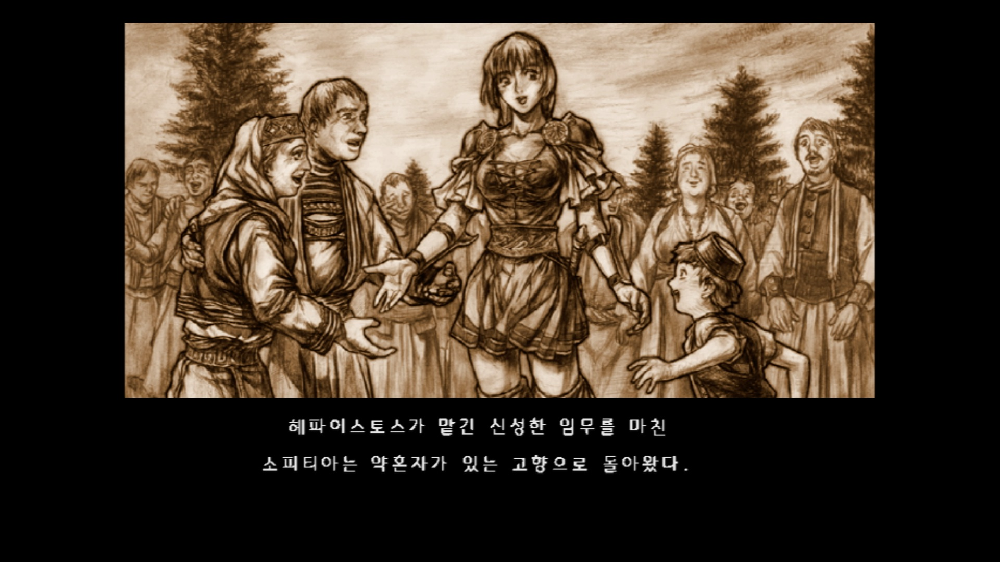

# 소울칼리버 XBOX 360 한글 패치

## 개요

XBOX 360 의 XBLA로 발매된 소울칼리버의 한글 및 와이드 패치입니다.

## 샘플 이미지
<p align="center">
  
  <br>
  
  
</p>

## 지원되는 기능
* 메뉴 설명 텍스트 및 엔딩 텍스트 번역
* 와이드 스크린 패치
* 이니셜 등록시 AAA / SEX 등 금지어 해제

## 패치 방법

xdelta3 명령어를 사용하시거나 기타 가지고 계신 xdelta3 패치 프로그램을 이용하여 패치합니다.

```Powershell
xdelta3.exe -d `
  -s "SoulCalibur [58410904]" `
  "SoulCalibur-korean-v1.0.0.xdelta" `
  "SoulCalibur-korean-v1.0.0"
```


## 다운로드
**[릴리즈 페이지](../../releases)** 에서 다운로드하세요.

본 패치를 다운로드하거나 사용하는 경우 아래의 면책조항 및 이용안내를 확인하고 이에 동의한 것으로 간주합니다.

## 면책조항

본 프로젝트는 비영리 목적의 팬 번역 프로젝트이며, 원작의 저작권은 해당 권리자에게 있습니다.

본 프로젝트는 게임 데이터, 실행 파일 또는 기타 저작권이 있는 원본 데이터를 포함하거나 배포하지 않습니다.

패치를 사용하려면 사용자가 합법적으로 취득한 원본 게임이 필요합니다.

프로젝트 운영자는 본 패치의 사용으로 인해 발생하는 어떠한 손해나 문제에 대해서도 책임을 지지 않습니다.

권리자의 요청이 있을 경우 본 프로젝트는 관련 자료의 공개를 중단하거나 삭제하는 등 필요한 조치를 취할 수 있습니다.

## 라이선스

### Fonts

이 프로젝트는 경기천년체 폰트를 사용하고 있습니다.

© GYEONGGI PROVINCE. All Rights Reserved.

---

Developed with GPT-6
